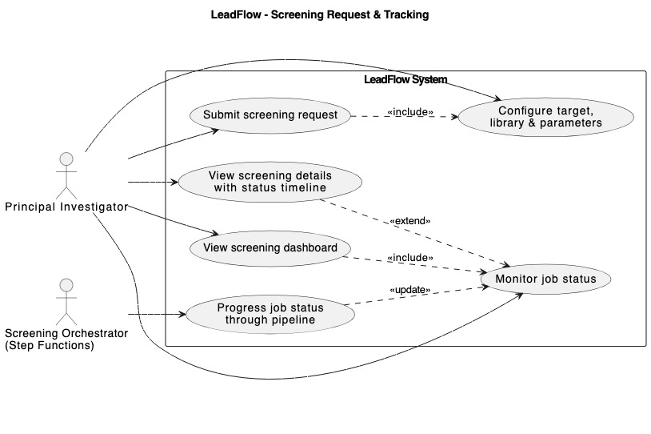
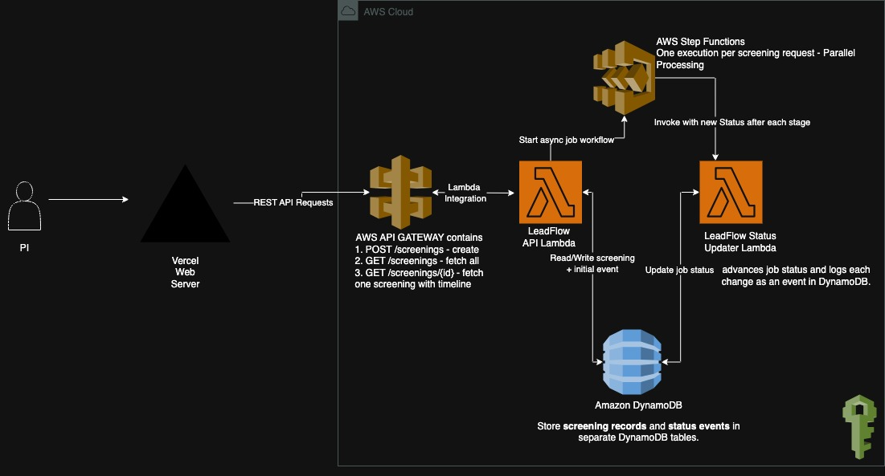
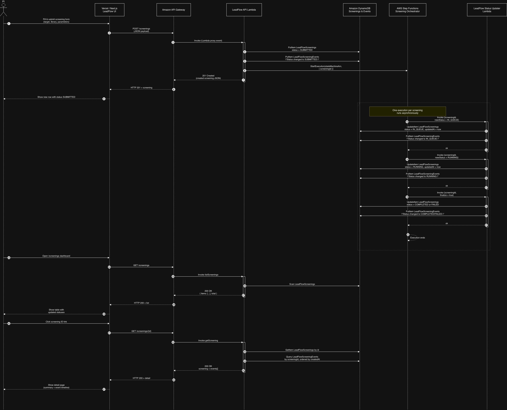

# LeadFlow – AIDD LeadFactory Screening Request & Status Tracker

LeadFlow is a lightweight full-stack demo that models a small but realistic slice of the A*STAR AIDD LeadFactory platform. It lets a Principal Investigator (PI) submit virtual screening requests (target + compound library + screening parameters), and then tracks each request as it moves asynchronously through a screening pipeline, with status updates and a time-ordered event timeline.

---

## Project Description

LeadFlow showcases how a PI-facing web application can orchestrate and monitor high-throughput screening jobs in a cloud-native way:

- **Frontend (Next.js, deployed on Vercel)**  
  - PI submits a new screening request by defining:
    - Target (protein/RNA, organism, external ID such as UniProt/Ensembl)
    - Library (e.g. LeadFactory core set or a custom library)
    - Screening parameters (screening type, priority, compute profile, notes)
  - Dashboard to list all screening requests with their current status.
  - Detail view for a single screening, showing a status badge and a timeline of events (status changes and system messages).

- **Backend (AWS serverless)**  
  - **API Gateway** exposes:
    - `POST /screenings` – create a new screening request
    - `GET /screenings` – list existing screenings
    - `GET /screenings/{id}` – fetch a screening with its event timeline
  - **LeadFlow API Lambda (Python)** handles all `/screenings` endpoints:
    - Persists screening metadata to `LeadFlowScreenings` (DynamoDB)
    - Writes initial `SUBMITTED` status event to `LeadFlowScreeningEvents`
    - Starts a Step Functions state machine execution for that screening
  - **Step Functions “Screening Orchestrator”**:
    - Runs one execution per screening request
    - Progresses status over time: `SUBMITTED → IN_QUEUE → RUNNING → COMPLETED/FAILED`
    - Invokes a dedicated Status Updater Lambda at each transition
  - **Status Updater Lambda (Python)**:
    - Updates the screening’s `status` and `updatedAt` in `LeadFlowScreenings`
    - Appends structured `STATUS_CHANGE` events into `LeadFlowScreeningEvents`
  - **DynamoDB**:
    - `LeadFlowScreenings` – one item per screening (current state + metadata)
    - `LeadFlowScreeningEvents` – append-only timeline of events per screening

The goal of this project is to demonstrate how LeadFactory-style screening workflows can be modeled as **parallel Step Functions executions**, with a clean separation between screening metadata, event history, and the PI-facing UI.

---

## Use Case Diagram



---

## API Reference 

#### Get all screenings
```http
  GET /screenings
```

#### Get screening by id

```http
  GET /screenings/{id}
```
| Parameter | Type     | Description                                 |
| :-------- | :------- | :------------------------------------------ |
| `id`      | `string` | **Required**. ID of the screening to fetch. |

Implementation detail: this endpoint reads from both LeadFlowScreenings (current state) and LeadFlowScreeningEvents (event timeline) and returns a combined view.

```http
  POST /screenings
```

| Field                | Type         | Description                                                             |
| :------------------- | :----------- | :---------------------------------------------------------------------- |
| `user_id`            | `int`        | ID of the user / PI creating the screening (currently mocked as `1`).   |
| `target.name`        | `string`     | Target name (e.g. `EGFR`, `BRD4`, `SARS-CoV-2 RdRp`).                   |
| `target.type`        | `string`     | `PROTEIN` or `RNA`.                                                     |
| `target.external_id` | `string`     | (Optional) External ID (e.g. UniProt / Ensembl).                        |
| `target.organism`    | `string`     | (Optional) Organism (e.g. `Homo sapiens`, `SARS-CoV-2`).                |
| `library_id`         | `int \| str` | Logical ID of the compound library.                                     |
| `library_name`       | `string`     | (Optional) Library display name (defaults to `"LeadFactory Core Set"`). |
| `screening_type`     | `string`     | `VIRTUAL_SCREENING`, `DOCKING`, `QSAR`, or `HTS`.                       |
| `priority`           | `string`     | `LOW`, `MEDIUM`, or `HIGH` (defaults to `MEDIUM`).                      |
| `requested_compute`  | `string`     | `SMALL`, `MEDIUM`, or `LARGE` (defaults to `MEDIUM`).                   |
| `notes`              | `string`     | (Optional) Free-text notes for the screening request.                   |


## Accessing Live Endpoints

Application Live: https://lead-flow-2n4h.vercel.app/screenings

You can test GET APIs directly at:

#### Get all screenings:

https://wynh5wgt0j.execute-api.eu-north-1.amazonaws.com/prod/screenings


#### Get screening by ID:

https://wynh5wgt0j.execute-api.eu-north-1.amazonaws.com/prod/screenings/


## Architecture

A key part of the architecture is AWS Step Functions, which runs one workflow execution per screening request and orchestrates the asynchronous status progression (SUBMITTED → IN_QUEUE → RUNNING → COMPLETED/FAILED) with built-in wait states, retries, and parallel executions across many screenings.

I chose a serverless AWS architecture because it can provide easy horizontal scaling. We can scale up or scale down more Lambda functions, and the DynamoDB tables can be set to auto-scale as well according to traffic. 

Screening records and events are partitioned by screening/job ID in DynamoDB, which gives fast, targeted retrieval of a single job’s state and timeline.

In future, if we want to add security features like requiring an API key for access, or requiring authorization using a JWT token, it can be easily set up in API Gateway.

At a high level, LeadFlow consists of:

- **Vercel (Next.js UI)** – PI-facing web app for creating and monitoring screening requests.
- **Amazon API Gateway** – exposes `GET /screenings`, `GET /screenings/{id}`, and `POST /screenings`.
- **LeadFlow API Lambda (Python)** – handles HTTP requests, persists screenings, writes initial events, and starts Step Functions executions.
- **AWS Step Functions “Screening Orchestrator”** – runs one execution per screening, progressing status over time.
- **LeadFlow Status Updater Lambda** – updates screening status and logs status-change events.
- **Amazon DynamoDB** – stores screening records and status events in separate tables.



## Sequence Diagram

The sequence diagram below shows the end-to-end flow for a screening request: from the PI submitting a job in the Next.js UI, through API Gateway and the API Lambda, into DynamoDB, and then asynchronously through the Step Functions orchestrator and Status Updater Lambda, before being read back by the UI.



## Limitations

When retrieving all screenings, we currently use DynamoDB’s `Scan` operation with a fixed limit. `Scan` is limited to 1 MB per call (roughly ~1000 items), and our implementation additionally caps results at 100 items.

As the data grows, `GET /screenings` may only return the first page of results and not the full dataset.

A more robust solution is to add pagination to the API. For example, the new endpoint could be:

```http
  GET /screenings?page={page}&limit={limit}
```

| Parameter | Type  | Description                                  |
| :-------- | :---- | :------------------------------------------- |
| `page`    | `int` | **Required**. Page number.                   |
| `limit`   | `int` | **Required**. Number of screenings per page. |


Additionally, the current Step Functions workflow uses mock wait times and randomized completion/failed status to simulate screening progression. In a production LeadFactory environment, these waits would be replaced by real downstream processing (e.g. docking/QSAR/virtual screening pipelines), and state transitions would be driven by actual job completion signals rather than timed mocks.